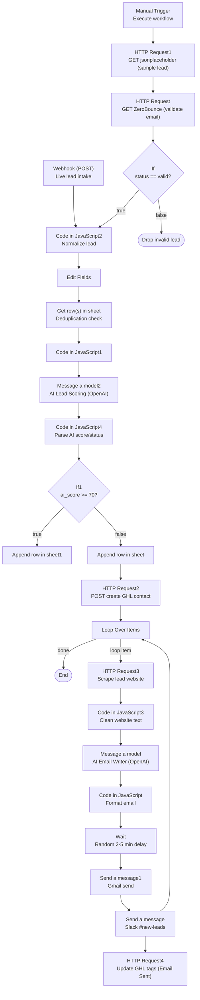

# LeadPilot — AI-Powered Lead Automation Engine

> Capture. Score. Personalize. Close. Fully automated.

---

## What It Does

LeadPilot is a zero-touch lead pipeline built on n8n. The moment a lead enters — via webhook or CRM sync — the system validates, scores, enriches, and reaches out with a hyper-personalized email, all without human intervention.

No missed leads. No duplicate contacts. No generic cold emails.

> **Beats spam filters by design:** every email is uniquely written from the lead's own website content (never a template) and sent after a randomized 2–5 minute delay, so outreach reads — and behaves — like it was sent by a human, not a blast tool.

---

## Pipeline at a Glance

```
Webhook / Manual Trigger
        │
        ▼
  Email Validation          ← ZeroBounce API (drops invalid emails)
        │
        ▼
  Lead Normalization        ← Parses name, email, phone, city, website, budget
        │
        ▼
  Deduplication Check       ← Cross-references Google Sheets by email
        │
        ▼
  AI Lead Scoring           ← GPT-4o-mini scores 0–100 (Hot / Warm / Cold)
        │
       / \
      /   \
  Score ≥ 70         Score < 70
      │                   │
      ▼                   ▼
  Hot Lead Sheet      Cold Lead Sheet
  GHL Contact Created
      │
      ▼
  Website Scrape            ← Fetches and strips lead's website HTML
      │
      ▼
  AI Email Writer           ← GPT-4.1-mini writes personalized outreach
      │
      ▼
  Random Delay (2–5 min)    ← Anti-spam throttle
      │
      ▼
  Gmail Send
      │
      ▼
  Slack Notification        ← #new-leads channel alert
      │
      ▼
  GHL Tag Update            ← "Email Sent", "AI Personalized", "Slack Notified"
```

---

## Agent Workflow Diagram

The diagram below mirrors the actual n8n canvas node-for-node.



---

## Integrations

| Integration | Purpose |
|---|---|
| **GoHighLevel (GHL)** | CRM contact creation & tag management |
| **Google Sheets** | Lead storage, deduplication, cold-lead archive |
| **ZeroBounce** | Real-time email address validation |
| **GPT-4o-mini** | Lead scoring with structured JSON output |
| **GPT-4.1-mini** | Personalized outreach email generation |
| **Gmail** | Automated email delivery |
| **Slack** | Instant team notifications on new leads |

---

## AI Lead Scoring

Each lead is scored from **0 to 100** across five dimensions:

| Criteria | Weight |
|---|---|
| Contact quality & reachability | 20 pts |
| Budget strength & commercial value | 25 pts |
| Business / website credibility | 20 pts |
| Fit for automation/CRM services | 20 pts |
| Sales follow-up priority | 15 pts |

**Routing logic:**
- `75–100` → **Hot** — routed to GHL, immediate outreach
- `50–74` → **Warm** — routed to GHL, immediate outreach
- `< 50` → **Cold** — archived in low-score sheet, no outreach

---

## AI Outreach Email

Before writing the email, the system:

1. Scrapes the lead's website and extracts up to 4,000 characters of clean text
2. Feeds that content to GPT-4.1-mini along with the lead's name, city, and contact info
3. Generates a **sub-120-word**, professional, no-fluff email referencing one real point from their site

No placeholders. No fake claims. Every email reads like it was written by hand.

---

## Deduplication

Before any lead reaches scoring or CRM, the system queries Google Sheets and filters out any email already on record. Duplicates are silently dropped — no noise, no double-contacts in GHL.

---

## Solving the Spam Problem

Cold outreach normally gets flagged for two reasons: **identical templated content** and **bursty, bot-like send patterns**. LeadPilot's pipeline is built to defeat both:

- **Personalization kills pattern-matching** — every email is generated fresh from the lead's own scraped website content (see [AI Outreach Email](#ai-outreach-email)), so no two messages share the same boilerplate for spam filters to fingerprint.
- **Randomized delay kills rate-based detection** — each send is throttled by a **random 2–5 minute delay** per contact ([Anti-Spam Throttle](#anti-spam-throttle) in the pipeline), breaking the fixed-interval "blast" signature that triggers ESP and inbox spam filters.

Together, content variation + timing variation make automated outreach indistinguishable from a human sending one-off emails — protecting sender reputation and keeping deliverability high at scale.

---

## Anti-Spam Throttle

Emails are dispatched with a **random 2–5 minute delay** per contact to avoid triggering spam filters and maintain a natural sending cadence.

---

## Setup Requirements

- **n8n** instance (self-hosted or cloud)
- GoHighLevel account with API bearer token and location ID
- Google Sheets OAuth2 credentials connected to n8n
- ZeroBounce API key
- OpenAI API key (GPT-4o-mini + GPT-4.1-mini access)
- Gmail OAuth2 credentials connected to n8n
- Slack OAuth2 credentials connected to n8n with a `#new-leads` channel

---

## Workflow Triggers

| Trigger | Use Case |
|---|---|
| **Webhook (POST)** | Production — receives leads from forms, landing pages, or external tools |
| **Manual Execute** | Testing — pulls sample data from JSONPlaceholder and runs the full pipeline |

---

## Built By

**Muhammad Hamza** — AI Automation Engineer  
Specializing in n8n workflows, CRM automation, AI-powered sales operations, and full-stack integrations.
